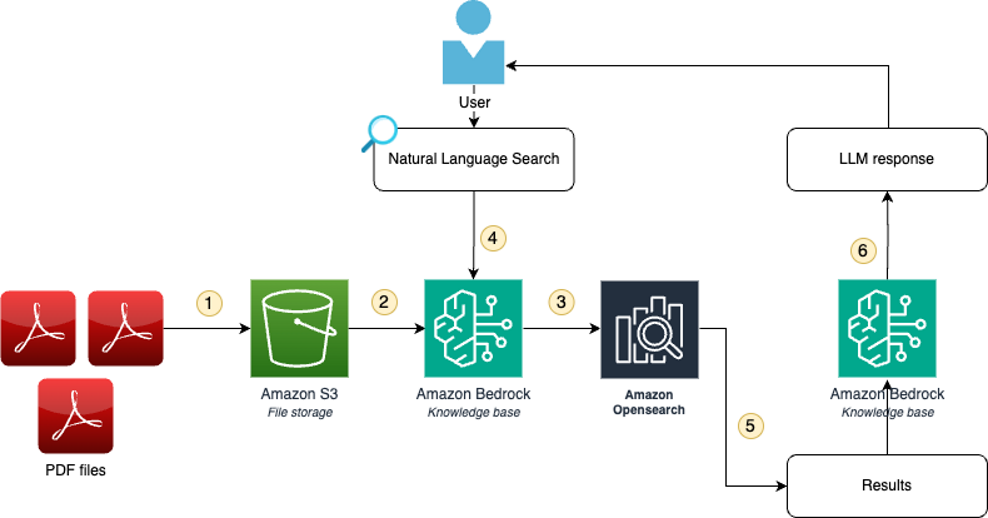
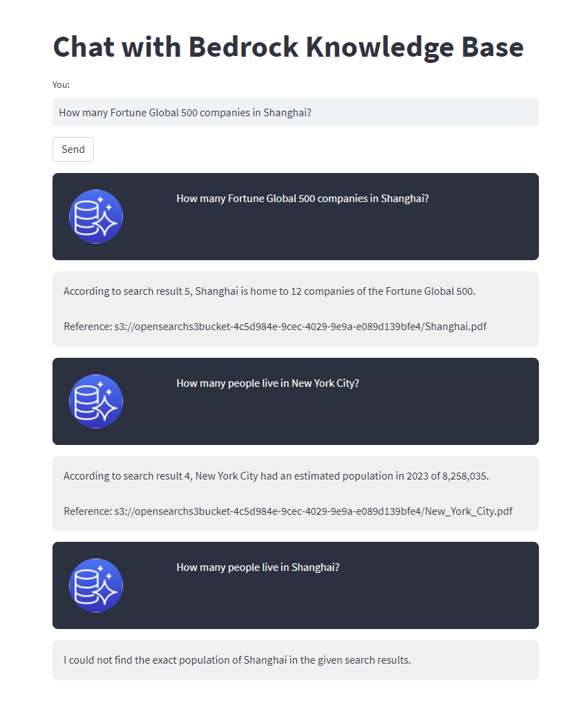
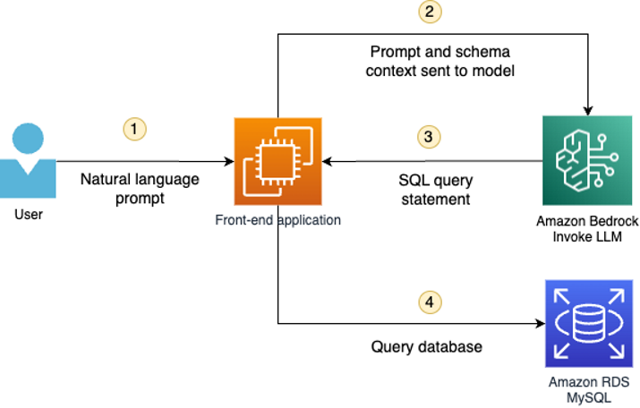
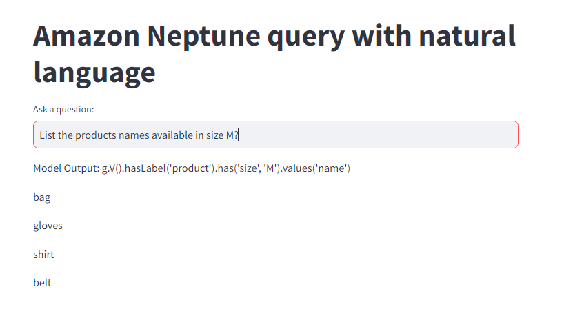
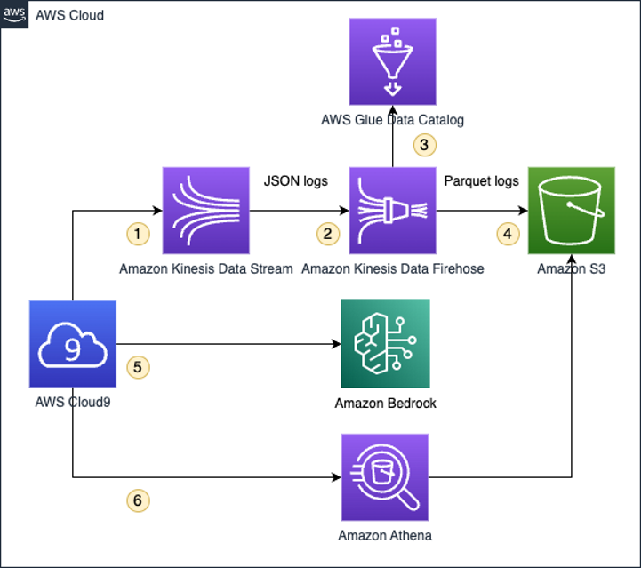
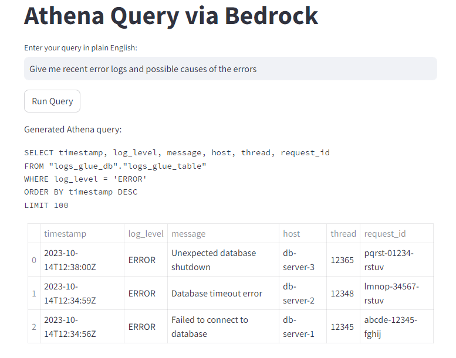

Sample bedrock code in preparation to adopt https://blog.langchain.dev/langgraph-multi-agent-workflows/ on bedrock

Below are completed code for labs https://catalog.workshops.aws/genai-on-aws/en-US

**Stream 2: Working with private documents**  
anthropic.claude-v2|amazon.titan-embed-text-v1

**Stream 6: Working with SQL database**  
Anthropic Claude v2 on MySQL

**Stream 7: Working with graphs**  
anthropic.claude-v2
Amazon Neptune graph database

**Stream 9: Working with logs**  
anthropic.claude-v2

**Stream 11: Working with CSV files**  
LangChain | anthropic.claude-instant-v1
